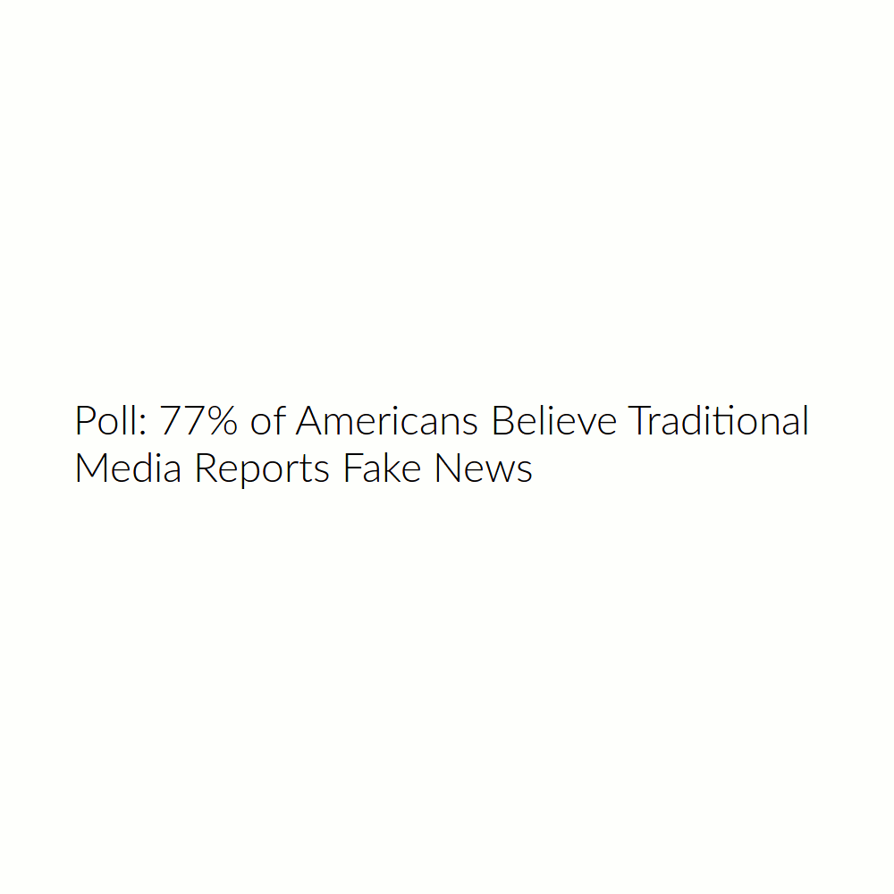

```{r, echo=FALSE, cache=TRUE, message=FALSE, warning=FALSE}
library('ggplot2')
library('dplyr')
```

## About me
 - University of Nebraska, Omaha
     - B.S. Computer Science and Mathematics (2009)
     - M.S. Mathematics, Data Science (May, 2018)
 - Software Engineer (2004-present)
 - Flight Operations, U.S. Army National Guard (2000-2009)
<div align="center" style="padding-top: 20px;">
  <div style="width:200px; height:200px; display: inline-block;">
  
  </div>
  <div style="width:200px; height:200px; display: inline-block;">
  
  </div>
  <div style="width:200px; height:200px; display: inline-block;">
  
  </div>
  <div style="width:200px; height:200px; display: inline-block;">
  
  </div>
</div>


## A fun experiment
- Step 1: Pick a random percentage. eg. 54%, 28%, 77%, etc.
- Step 2: Type that number into google followed by "of Americans"
- Step 3: Follow rabit hole for hours

## 
  


## Simple random sample
- Pólya urn model
- With (SRSWR) or Without Replacement (SRSWOR)
    - With replacement - makes use of i.i.d. assumption
    - Without replacement - not i.i.d. but still exchangeable
- Requires access to the entire population

  <div style="width:200px; height:200px; display: inline-block;">
  
  </div>
  
<div class="notes">
So how do we come to these conclusions? Well, we could do a Simple Random Sample.

Polya Urn Models. This is what you learn in Prob Stat I and II. It can either be with
or without replacement. With replacement maintains i.i.d. assumptions so all of our 
nice statistical techniques can be used. If we do it without replacement, we lose 
our i.i.d. assumption, but we still have exchangeability, so 
</div>


## Sampling design
- Sampling plan
- Method for drawing inferences
- Cell A: Vast majority of surveys

+--------------------------+------------------------+-----------------------+
| Sampling Plan            | Design-based inference | Model-based inference |
+==========================+========================+=======================+
| Probability sample       | A                      | C                     |
+--------------------------+------------------------+-----------------------+
| Model-dependent sample   | B                      | D                     |
+--------------------------+------------------------+-----------------------+

<div class="notes">
  When we talk about survey sample design or sampling strategy, 
  we're talking about two components: 
  A sampling plan, and a method for drawing inferences. 
  
  We essentially have two schools of thought on each, which, when combined,
  gives us this 2x2 matrix of choices. I'm going to talk about each of these,
  but by and large, cell A, Probability sampling with a Design-based inferrence
  is what you will most commonly find in the wild.
  
  Cells A and D are natural pairings, but it is not uncommon to find the 
  hybrid approaches of B and C in survey research.
</div>

## Sampling plan
- Population frame
    - Target population
- Sampling frame

<div class="notes">
  A population frame is the list of $N$ units making up the finite population \cite{Chambers}
  It is theoretically possible to enumerate the entire population, but rarely practical due to
  limited time, funding, and resources.
 
  Our goal is to estimate the population parameters with minimal sampling effort. 
  
  To do this we need a Sampling Frame. 
  
  A sampling frame is the list of all elements from which we can draw a sample. 
  Maybe that is registered voters, maybe that's a list of all students in a university.
  
  But it has to be enumerable, we can't just include "all people in America". That could be
  the target population. The target population is finite and theoretically enumerable, but
  in most cases, it would be impractical if not logistically impossible to exhaustively survey.
  So that's why we turn to complex survey design.
  
  A probability sampling plan assigns non-zero probabilities of selection
  to each member of the sampling frame. Sample choices are then randomized.
  
  Model-dependent sampling plans, on the other hand, assume the statistics of interest
  follow a known probability distribution. They then seek to draw samples that maximize
  the precision (or minimize the variance) of estimation for the statistics of interest.
  
  These are not common in survey practice. Surveys are generally intended to be multi-purpose,
  and if the wrong model is used, it can lead to biased estimates. 
</div>

## Design effects

```{r, echo=FALSE, cache=TRUE, fig.height=5, fig.width=6}
std.err.p <- c(0.030, 0.020, 0.015, 0.010, 0.008, 0.007, 0.0065, 0.0064, 0.00635, 0.00635, 0.0063)
sample.size <- c(100, seq(250, 2500, by=250))
data.frame(std.err.p, sample.size) %>%
  ggplot(aes(sample.size, std.err.p)) +
    geom_smooth(method="loess", se=FALSE) +
    labs(title="Tug-of-war between Stratification and Clustering/Weighting", x="Sample size", y="Standard error of P") +
    annotate("text", x = 600, y = 0.022, label = sprintf('\u21E7'), size=48) +
    annotate("text", x = 600, y = 0.022, label = "Cluster sampling", size=4, angle=90)  +
    annotate("text", x = 1000, y = 0.020, label = sprintf('\u21E7'), size=48) +
    annotate("text", x = 1000, y = 0.020, label = "Weighting", size=4, angle=90) +
    annotate("text", x = 250, y = 0.015, label = sprintf('\u21E9'), size=48) +
    annotate("text", x = 250, y = 0.015, label = "Stratification", size=4, angle=90) +
    annotate("text", x = 1500, y = 0.025, label = "Loss (L_cluster, L_weighting)", size=4) +
    annotate("text", x = 250, y = 0.009, label = "Gain (G_strat)", size=4) 
```

<div class="notes">
  
</div>

## Survey population
- Population we can actually sample under the survey design

## Complex Sampling
- Probability sampling

## Stratification

## Clustering

## Weighting

## H-CUP Nationwide Inpatient Sample
- Healthcare Cost and Utilization Project
- Must be purchased

## NIS Sampling Design
- Sampling frame - hospitals
- Sampling plan
- Method for drawing inferences
- Cell A: Vast majority of surveys

<div class="notes">
  In the NIS, each element of the population is associated with a hospital. A
  sample of the hospitals is drawn, and then a sample within each selected hospital 
  is drawn.
</div>

## NIS Complex Survey Design - Stratification

## NIS Complex Survey Design - Clustering
- Clustered on hispitals

## NIS Complex Survey Design - Weighting
- Discharge weight (DISCWT) is used to produce national estimates

## NIS Dimensions
- Big data?
- Definitely **large** data


## Sources and Further Reading
- Heeringa, S., West, B. T., Berglund, P. A., Applied Survey Data Analysis, 2nd Ed., *CRC Press*, 2017
- Chambers, R. L., Which Sample Survey Strategy? A Review of Three Different Approaches, *University of Wollongong Research Online*, 2011
- Kalton, G., Introduction to Survey Sampling, *SAGE Publications*, 1983
- Little, R. http://hummedia.manchester.ac.uk/institutes/cmist/BADEN/Workshop-2015/2015-11-BADEN_Workshop_Presentation_Little.pdf