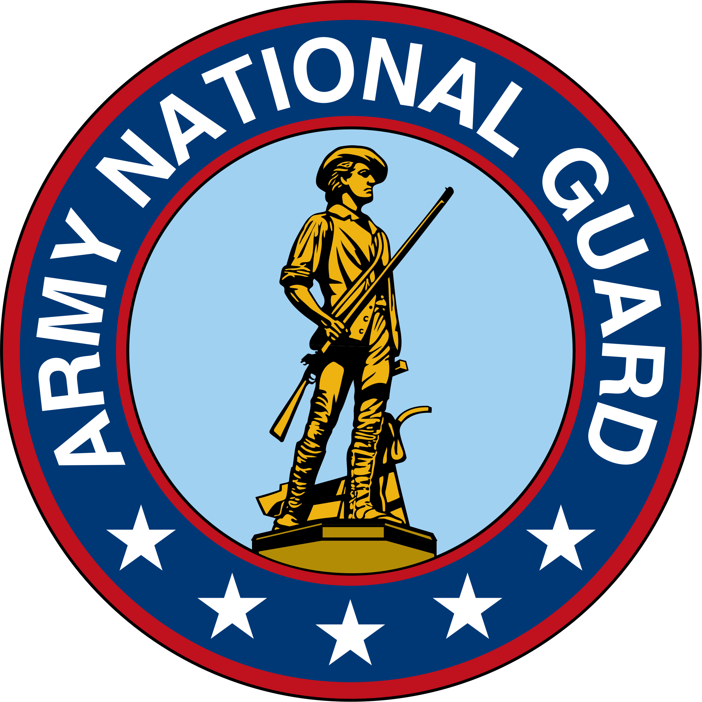

Complex Survey Analysis and the H-CUP NISC
========================================================
author: Brian Detweiler
date: April 20, 2018
autosize: true

About Me
========================================================

- B.S. Computer Science and Mathematics - University of Nebraska, Omaha
- Graduate Student, Data Science - University of Nebraska, Omaha
- Software Developer, 15 years
- Flight Operations, U.S. Army National Guard, 9 years

Survey Design
========================================================
- Finite population (people in the U.S., registered voters, hospital patients, etc.)
- Rarely practical
  - Limited time, funding, and resources
- Goal: Estimate population parameters with minimal sampling effort

Simple Random Sample (SRS)
========================================================
- Sample with or without replacement (Urn model)
- With replacement - makes use of i.i.d. assumption
- Without replacement - not i.i.d. but still exchangeable
- Requires access to the whole population (complete sampling frame)

Complex Sampling
========================================================
- Probability sampling

Stratification
========================================================

Clustering
========================================================

Weighting
========================================================

H-CUP Nationwide Inpatient Sample
========================================================
- Healthcare Cost and Utilization Project
- Must be purchased

NIS Complex Survey Design - Stratification
========================================================

NIS Complex Survey Design - Clustering
========================================================
- Clustered on hispitals

NIS Complex Survey Design - Weighting
========================================================
- Discharge weight (DISCWT) is used to produce national estimates
