```{r, echo=FALSE, cache=TRUE, message=FALSE, warning=FALSE}
library('ggplot2')
library('tidyverse')
library('knitr')
options(survey.adjust.domain.lonely=TRUE)
options(survey.lonely.psu="remove")
knitr::opts_chunk$set(cache = TRUE, warning = FALSE,  message = FALSE, cache.lazy = FALSE)
```

<style>
div.cite {
  display: block;
  font-size: 0.6em;
  text-align: left;
}

div.blockquote {
  display: block;
  font-size: 0.6em;
  text-align: left;
}

div.equation {
  display: block;
  font-size: 0.6em;
  text-align: left;
}

/* Don't capitalize headers */
.reveal h1 {
  text-transform: none;
}

span.diff-title {
  text-transform: none;
  font-style: italic;
}

</style>


# <Hello and thank you for coming!

## Alternative titles
- How to lose friends and infect people
- **Epidemiology!** For fun and for profit
- <div style="width:225px; margin:auto; display: block;">
  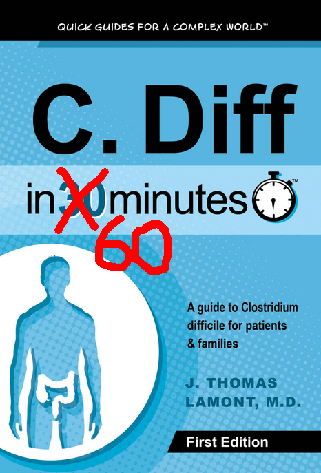
</div>
- <div style="width:60px; display: inline-block;">
    
  </div>
  <div style="width:60px; display: inline-block;">
    
  </div>
  <div style="width:60px; display: inline-block;">
    
  </div>
  <div style="width:60px; display: inline-block;">
    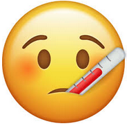
  </div>
  <div style="width:60px; display: inline-block;">
    
  </div>
  <div style="width:60px; display: inline-block;">
    
  </div>

## About me
 - University of Nebraska, Omaha
     - B.S. Computer Science and Mathematics (2009)
     - M.S. Mathematics, Data Science (May, 2018)
 - Software Engineer (2004-present)
 - Flight Operations, U.S. Army National Guard (2000-2009)
<div align="center" style="padding-top: 20px;">
  <div style="width:200px; height:200px; display: inline-block;">
  
  </div>
  <div style="width:200px; height:200px; display: inline-block;">
  
  </div>
  <div style="width:200px; height:200px; display: inline-block;">
  
  </div>
  <div style="width:200px; height:200px; display: inline-block;">
  
  </div>
</div>


## Agenda

1. Introduction and motivation
2. C. *diff* and renal failure
3. The data
4. Methodology
5. Results


# Introduction and motivation

## Why are we here?

## Pr(You)

- $Pr(\text{boy meets girl}) = \frac{1}{20000}$
- $Pr(\text{same boy knocks up same girl}) = \frac{1}{2000}$
- $Pr(\text{right sperm meets right egg})$ = 1 in 400 quadrillion
- $Pr(\text{lineage})$: 1 in $10^{45000}$
- $Pr(\text{you})$ = 1 in $10^{2685000}$

<div class="cite">
So what’s the probability of your existing?  It’s the probability of 2 million people getting together – about the population of San Diego – each to play a game of dice with trillion-sided dice. They each roll the dice, and they all come up the exact same number – say, 550,343,279,001.

A miracle is an event so unlikely as to be almost impossible.  By that definition, I’ve just shown that you are a miracle.

Benazir, A. [What are the chances of your coming into being?](http://blogs.harvard.edu/abinazir/2011/06/15/what-are-chances-you-would-be-born/) (2011)
</div>

## Data Science

  

## Finding a project
- `r knitr::asis_output("\U1F6AB")` Union Pacific PTC data (2016-2017) - SCRAPPED
- `r knitr::asis_output("\U2705")` HCUP project through Creighton

  
## asdf

## 6

## 7

## 8

## 9

## 10

## 11

## 12

## 13

## 14

## 15

## 16

## 17

## 18

## 19

## 20

## 21

## 22

## 23

## 24

## 25


# C. <span class="diff-title">diff</span> and renal failure

## C. <span class="diff-title">diff</span>
- Clostridium *difficile* 
- Gram-positive, rod-shaped, Endospore-forming bacterium

<div style="width:400px; display: block; margin: auto;">
  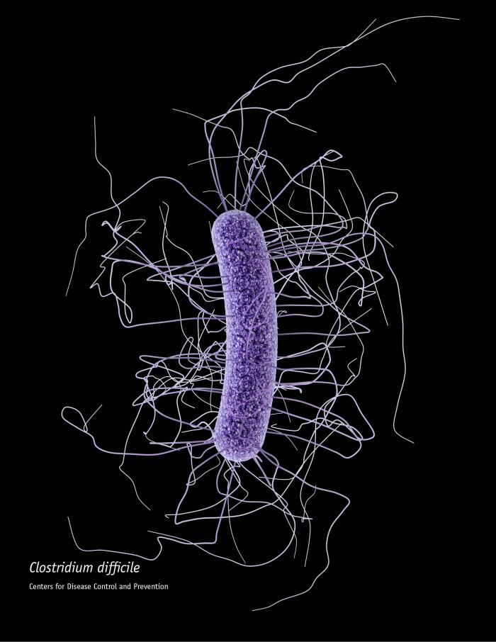
</div>


## Scientific Classification
+--------------------------+----------------------------+
| **Kingdom**              | Bacteria                   |
+--------------------------+----------------------------+
| **Phylum**               | Firmicutes                 |
+--------------------------+----------------------------+
| **Class**                | Clostridia                 |
+--------------------------+----------------------------+
| **Order**                | Clostridiales              |
+--------------------------+----------------------------+
| **Family**               | Clostridiaceae             |
+--------------------------+----------------------------+
| **Genus**                | Clostridium                |
+--------------------------+----------------------------+
| **Species**              | C. *difficile*             |
+--------------------------+----------------------------+

## Where it lives
- Intestinal tract of healthy people 
    - 13.6% of children, 5.5% of adults are colonized
<div class="cite">Tetro, J. <a href="https://www.popsci.com/clostridium-difficile-is-more-common-than-you-think">Clostridium difficile Is More Common Than You Think</a> (2016)</div>
- Soil
- Water
- Feces of infected animals and humans
- Surfaces for up to 5 months

## Signs / symptoms
- Diarrhea
- Fever
- Nausea
- Abdominal pain
- Pseudomembranous colitis
- Toxic megacolon
- Perforation of the colon
- Sepsis

## CDI Risk
<div style="width:1000px; display: block; margin: auto;">
  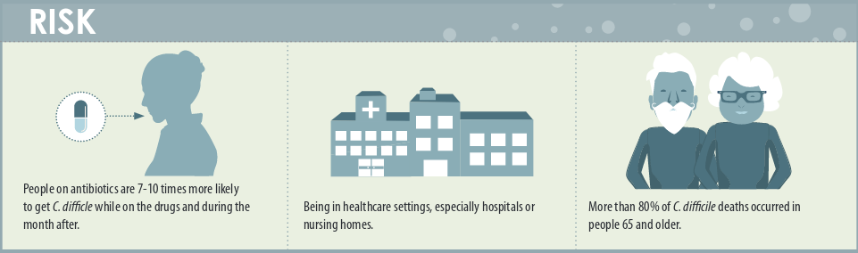
</div>
<div class="cite"><a href="https://www.cdc.gov/hai/pdfs/cdiff/CDiff-One-Pager.pdf">CDC</a></div>

## How CDI Spreads
<div style="width:1000px; display: block; margin: auto;">
  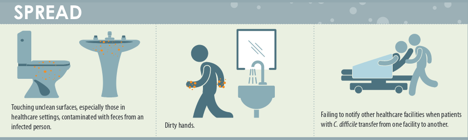
</div>
<div class="cite"><a href="https://www.cdc.gov/hai/pdfs/cdiff/CDiff-One-Pager.pdf">CDC</a></div>

## Renal (kidney) disease
- Acute kidney injury (AKI)
- Chronic kidney disease
    - Stages 1-4
- Stage 5 - End-stage renal disease (ESRD)
- Dialysis or transplant

## Renal disease signs / symptoms

- Nausea
- Vomiting
- Loss of appetite
- Fatigue and weakness
- Sleep problems
- Changes in urine volume
- ...much more

## AKI Causes
- Decreased bloodflow
- Direct damage to kidneys
- Urinary tract blockage

## AKI Risks

- Hospitalization
- Advanced age
- Blood vessel blockage in arms/legs
- Diabetes
- High blood pressure
- Heart failure
- Kidney diseases
- Liver diseases
<div class="cite"><a href="https://www.mayoclinic.org/diseases-conditions/kidney-failure/symptoms-causes/syc-20369048">Mayo Clinic</a></div>

## CKD Causes
- Type I/II diabetes
- High blood pressure
- ...much more

## CKD risk

- Cardiovascular disease
- Smoking
- Obesity
- Being African-American, Native American or Asian-American
- Family history of kidney disease
- Abnormal kidney structure
- Older age
<div class="cite"><a href="https://www.mayoclinic.org/diseases-conditions/chronic-kidney-disease/symptoms-causes/syc-20354521">Mayo Clinic</a></div>

## Measuring kidney function 
- Glomerular Filtration Rate (GFR)
- MDRD
<div class="equation">
$$
  GFR = 175 \times S_{cr} - 1.154 \times \text{Age}^{-0.203} \times 0.742 \cdot I(\text{F}) \times 1.212 \cdot I(\text{AA})
$$
</div>
- CKD-EPI
<div class="equation">
$$
  GFR = 141 \times min\bigg(\frac{S_{cr}}{\kappa}, 1\bigg)^{\alpha} \times max\bigg(\frac{S_{cr}}{\kappa}, 1\bigg)^{-1.209} \\
  \times 0.993^{\text{Age}} \times 1.018 \cdot \text{I}(\text{F}) \times 1.159 \cdot \text{I}(\text{AA})
$$
</div>

- F is female sex
- AA is African American race
- I is 1 if true, else reciporcal of preceding term 
- $S_{cr}$ is serum creatinine in mg/dL
- $\kappa$ is 0.7 for females and 0.9 for males
- $\alpha$ is -0.329 for females and -0.411 for males

## CKD Stages

+--------------------------+----------------------------+-----------------------+
| Stage                    | Description                | GFR/Kidney Function   |
+==========================+============================+=======================+
| 1                        | Normal function            | 90+/90%+              |
+--------------------------+----------------------------+-----------------------+
| 2                        | Mild loss                  | 60-89/60-89%          |
+--------------------------+----------------------------+-----------------------+
| 3                        | Mild to severe             | 30-59/30-59%          |
+--------------------------+----------------------------+-----------------------+
| 4                        | Severe                     | 15-29/15-29%          |
+--------------------------+----------------------------+-----------------------+
| 5                        | Kidney failure (ESRD)      | 15 or less/15% or less|
+--------------------------+----------------------------+-----------------------+


## End-stage renal disease (ESRD)

- When stage 5 is reached
- Dialysis or kidney transplant


## Readmissions

- If hospital has "excess readmissions", penalties are assessed
- 30-day risk standardized measure to calculate Payment Readjustment Factor (PRF)
<div class="blockquote">
  All-cause unplanned readmissions to the same or another applicable acute care hospital, 
  ocurring within 30 days - for any reason, regardless of principal diagnosis - from the index admission are counted in this measure.
  Some planned readmissions are not counted. 
  <a href="https://www.cms.gov/Medicare/Quality-Initiatives-Patient-Assessment-Instruments/Value-Based-Programs/HRRP/Hospital-Readmission-Reduction-Program.html">HRRP</a>
</div>
<div class="equation">
$$
  \text{PRF} = 1 - min\bigg(0.03, \sum_{dx} \frac{\text{Payment}(dx) \cdot max\big((\text{ERR}(dx) - 1.0), 0\big)}{\text{All payments}}\bigg)
$$ 
</div>
- Where $dx$ is one of six measure cohorts, incl heart failure, pneumonia, et. al.
- ERR is a hospital's performance measure $dx$, and payment refers to base operating DRG payments. \cite{HRRPPaymentAdjustment, Lessa2015}


## 14

## 15

## 16

## 17

## 18

## 19

## 20

## 21

## 22

## 23

## 24

## 25


# The data

## 1

## 2

## 3

## 4

## 5

## 6

## 7

## 8

## 9

## 10

## 11

## 12

## 13

## 14

## 15

## 16

## 17

## 18

## 19

## 20

## 21

## 22

## 23

## 24

## 25


# Methodology


## A fun experiment
- Step 1: Pick a random percentage. e.g. 54%, 28%, 77%, etc.
- Step 2: Type that number into Google followed by "of Americans"
- Step 3: Follow rabbit hole for hours

## 
  <div style="width:600px; height:800px; display: inline-block;">
  
  </div>


## Simple random sample
- Pólya urn model
- With (SRSWR) or Without Replacement (SRSWOR)
    - With replacement - makes use of i.i.d. assumption
    - Without replacement - not i.i.d. but still exchangeable
- Requires access to the entire population

  <div style="width:200px; height:200px; display: inline-block;">
  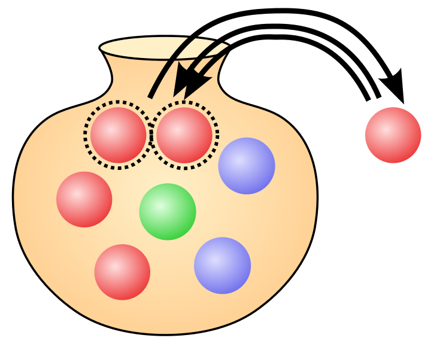
  </div>
  
<div class="notes">
So how do we come to these conclusions? Well, we could do a Simple Random Sample.

Polya Urn Models. This is what you learn in Prob Stat I and II. It can either be with
or without replacement. With replacement maintains i.i.d. assumptions so all of our 
nice statistical techniques can be used. If we do it without replacement, we lose 
our i.i.d. assumption, but we still have exchangeability, so, for instance, Bayesian
models only rely on exchangeability, rather than i.i.d.
</div>


## Sampling design

+--------------------------+----------------------------+-----------------------+
| Sampling Plan            | **Design-based inference** | Model-based inference |
+==========================+============================+=======================+
| **Probability sample**   | **A**                      | C                     |
+--------------------------+----------------------------+-----------------------+
| Model-dependent sample   | B                          | D                     |
+--------------------------+----------------------------+-----------------------+
| Quota sampling           | E                          | F                     |
+--------------------------+----------------------------+-----------------------+
| Convenience sampling     | G                          | H                     |
+--------------------------+----------------------------+-----------------------+
| Snowball sampling        | I                          | J                     |
+--------------------------+----------------------------+-----------------------+
| Peer nomination          | K                          | L                     |
+--------------------------+----------------------------+-----------------------+

<div class="notes">
  When we talk about survey sample design or sampling strategy, 
  we're talking about two components: 
  A sampling plan, and a method for drawing inferences from that sample. 
 
  There are essentially two main sampling plan approaches: Probability sampling
  plans and non-probability sampling plans. 
  
  Cells A and D are natural pairings, but it is not uncommon to find the 
  hybrid approaches of B and C in survey research. We're seeing more and more
  model-based inference - which you can think of as primarily Bayesian models - 
  with Nate Silver and FiveThirtyEight, or Nate Cohn and the NYT. It is becoming
  more and more common to run model-based inference on probability samples.
  
  However, most research is still done with design-based inference. 
  
  A probability sampling plan assigns non-zero probabilities of selection
  to each member of the sampling frame. Sample choices are then randomized.
  
  Model-dependent sampling plans, on the other hand, assume the statistics of interest
  follow a known probability distribution. They then seek to draw samples that maximize
  the precision (or minimize the variance) of estimation for the statistics of interest.
  
  These are not common in survey practice. Surveys are generally intended to be multi-purpose,
  and if the wrong model is used, it can lead to biased estimates. 
  
  Design-based inference is non-parametric, in that it only relies on the probability
  of each observation's inclusion. 
  
  Model-based inference is based on a probability distribution for the random variable
  of interest.
</div>


## Design effects

```{r, echo=FALSE, cache=TRUE, fig.height=5, fig.width=6}
std.err.p <- c(0.030, 0.020, 0.015, 0.010, 0.008, 0.007, 0.0065, 0.0064, 0.00635, 0.00635, 0.0063)
sample.size <- c(100, seq(250, 2500, by=250))
data.frame(std.err.p, sample.size) %>%
  ggplot(aes(sample.size, std.err.p)) +
    geom_smooth(method="loess", se=FALSE) +
    labs(title="Tug-of-war between Stratification and Clustering/Weighting", x="Sample size", y="Standard error of P") +
    annotate("text", x = 600, y = 0.022, label = sprintf('\u21E7'), size=48) +
    annotate("text", x = 600, y = 0.022, label = "Cluster sampling", size=4, angle=90)  +
    annotate("text", x = 1000, y = 0.020, label = sprintf('\u21E7'), size=48) +
    annotate("text", x = 1000, y = 0.020, label = "Weighting", size=4, angle=90) +
    annotate("text", x = 250, y = 0.015, label = sprintf('\u21E9'), size=48) +
    annotate("text", x = 250, y = 0.015, label = "Stratification", size=4, angle=90) +
    annotate("text", x = 1500, y = 0.025, label = "Loss (L_cluster, L_weighting)", size=4) +
    annotate("text", x = 250, y = 0.009, label = "Gain (G_strat)", size=4) 
```

<div class="notes">
  Complex survey designs make use of stratification, clustering, and/or weighting. 
</div>

## Design effects

  - "deft"
  - Similar to variance inflation factor (VIF)
  - Effective sample size
  
  $$
  D^2(\hat{\theta}) = \frac{SE(\hat{\theta})^2_{complex}}{SE(\hat{\theta})^2_{srs}} = \frac{var(\hat{\theta})_{complex}}{var(\hat{\theta})_{srs}}
  $$
  
  $$
  n_{eff} = \frac{n_{complex}}{d^2(\hat{\theta})}
  $$
  

## Clustering
- Grouping people by geographic regions
- SRS to choose a geographic region
  <div style="width:500px; height:500px; margin: auto; display: block;">
  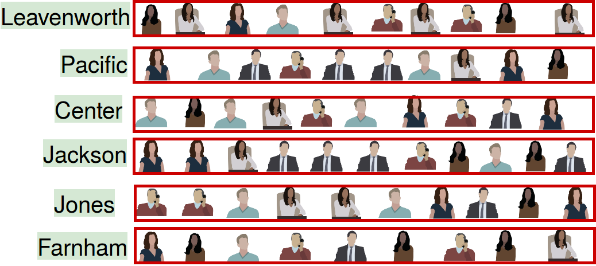
  </div>

## Clustering
  <div style="width:500px; height:500px; margin: auto; display: block;">
  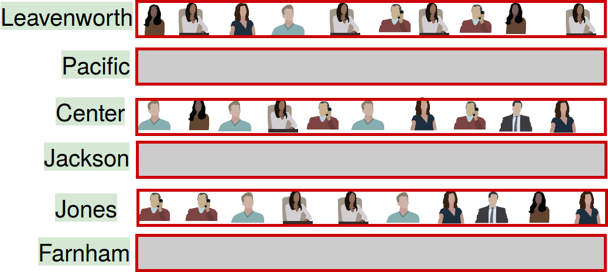
  </div>

## Stratification
  <div style="width:500px; height:500px; margin: auto; display: block;">
  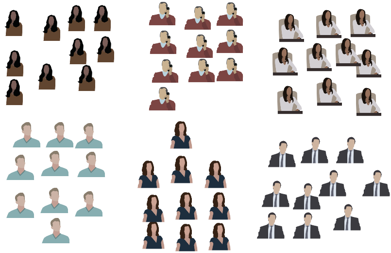
  </div>
  
## Stratification
  <div style="width:500px; height:500px; margin: auto; display: block;">
  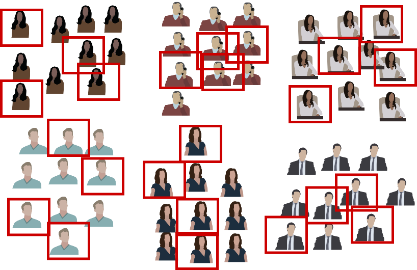
  </div>
  
<div class="notes">
</div>

## Weighting
- $N = 51$
  <div style="width:500px; height:500px; margin: auto; display: block;">
  
  </div>
  
<div class="notes">
</div>

## Weighting
- $N_{men} = 30$
- $p_{men} = \frac{30}{51} = 0.588$
  <div style="width:500px; height:500px; margin: auto; display: block;">
  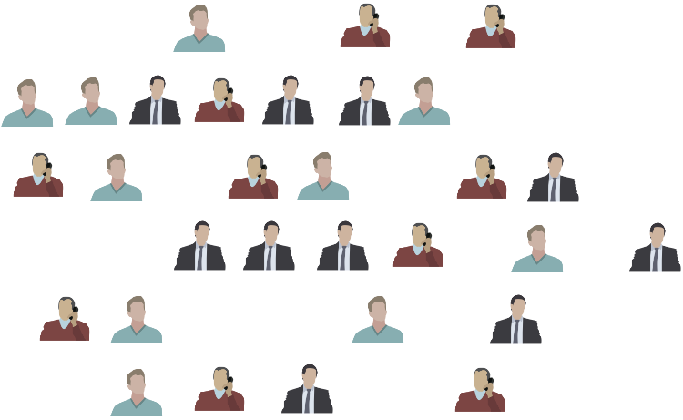
  </div>
  
<div class="notes">
</div>

## Weighting
- $N_{women} = 21$
- $p_{women} = \frac{21}{51} = 0.412$
  <div style="width:500px; height:500px; margin: auto; display: block;">
  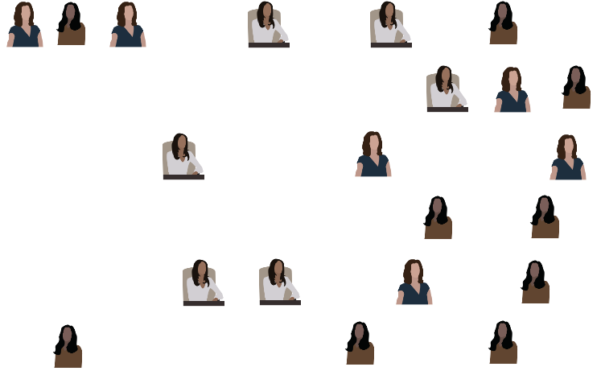
  </div>
  
## Weighting
- $N_{women} = 21$
- Women Odds Ratio: $\frac{p_{women}}{p_{men}} = \frac{0.588}{0.412} = 1.427$
- Men Odds Ratio: $\frac{p_{men}}{p_{women}} = \frac{0.412}{0.588} = 0.701$
  
<div class="notes">
</div>


## H-CUP Nationwide Inpatient Sample
- Healthcare Cost and Utilization Project
- Must be purchased

## NIS Sampling Design
- 1988-2011: 100% sample of 20% of HCUP hospitals
- 2012-present: 20% sample of 100% of HCUP hospitals

<div class="notes">
  In the NIS, each element of the population is associated with a hospital. A
  sample of the hospitals is drawn, and then a sample within each selected hospital 
  is drawn.
</div>


## NIS Complex Survey Design
- Clustered on hospital ID
- Weights included in `discwt` field for national estimates
- 1988-2011: Stratified by census region and bed size
- 2012-present: Stratified by census division and bedside
<div style="font-size: 50%">
    - Region 1 (Northeast)
        - Division 1 (New England)
        -Division 2 (Mid Atlantic)
    - Region 2 (Midwest)
        - Division 3 (East North Central)
        - **Division 4 (West North Central) (incl. Nebraska)**
    - Region 3 (South)
        - Division 5 (South Atlantic)
        - Division 6 (East South Central)
        - Division 7 (West South Central)
    - Region 4 (West)
        - Division 8 (Mountain)
        - Division 9 (Pacific)
</div>

## NIS dimensions
- Big data?
- Definitely **large** data
- ~3GB per year (raw CSV)

## Importance of survey design

- Treating as SRS

```{r readdata, message=FALSE, warning=FALSE, echo=FALSE, cache=TRUE}
cdiff <- read_csv('../data/cdiff.csv')
cdiff <- filter(cdiff, !is.na(los))
cdiff <- filter(cdiff, !is.na(age))
# Exclude patients who died
cdiff <- filter(cdiff, died == 0)
cdiff <- filter(cdiff, nis_year == 2011)
srs.fit <- lm(los~age, data=cdiff)

```

```{r srs, echo=TRUE, cache=TRUE}

summary(lm(los~age, data=cdiff))
```

## Importance of survey design

- Accounting for survey design with R survey package
```{r complex_fit, echo=FALSE, warning=FALSE, cache=TRUE}

library('survey')
cdiff <- filter(cdiff, nis_year == 2011)
cdiff.design <- svydesign(ids = ~hospid, data = cdiff, weights = ~discwt,  strata = ~nis_stratum, nest=TRUE)
complex.fit <- svyglm(los~age, design=cdiff.design)
```


```{r complex, echo=TRUE, warning=FALSE, cache=TRUE}
library('survey')

cdiff.design <- svydesign(ids = ~hospid, data = cdiff, weights = ~discwt,  strata = ~nis_stratum, nest=TRUE)
summary(svyglm(los~age, design=cdiff.design))
```

##  SRS vs. complex design
```{r srs_plot, echo=FALSE, warning=FALSE, message=FALSE, cache=TRUE, fig.height=5, fig.width=5, fig.cap="SRS line in red, complex design in blue"}

ggplot(cdiff, aes(age, los)) +
  geom_smooth() +
  geom_abline(slope = srs.fit$coefficients[[2]], intercept = srs.fit$coefficients[[1]], col="red") +
  geom_abline(slope = complex.fit$coefficients[[2]], intercept = complex.fit$coefficients[[1]], col="blue") +
  labs(title="Length of stay vs. Age for 2011 C. diff patients") 
```

## Research design checklist
- Khera and Krumholz, 2017

    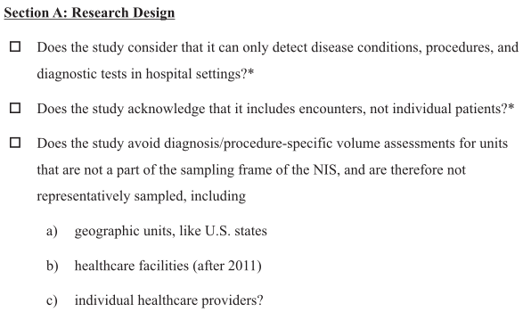
    
## Data interpretation checklist
- Khera and Krumholz, 2017

    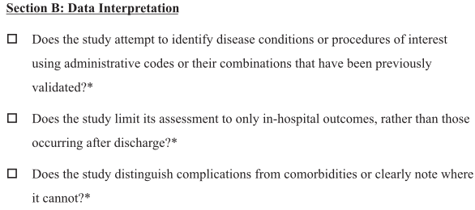

## Data analysis checklist
- Khera and Krumholz, 2017

    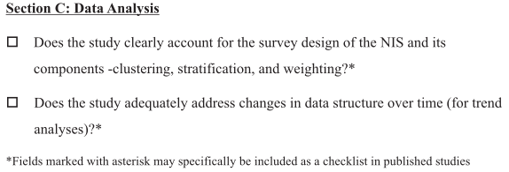


## 11

## 12

## 13

## 14

## 15

## 16

## 17

## 18

## 19

## 20

## 21

## 22

## 23

## 24

## 25


# Results

## 1

## 2

## 3

## 4

## 5

## 6

## 7

## 8

## 9

## 10

## 11

## 12

## 13

## 14

## 15

## 16

## 17

## 18

## 19

## 20

## 21

## 22

## 23

## 24

## 25


    
    
# Acknowledgements

## Very special thanks

- Renuga Vivekanandan, M.D.
- Ryan Walters, Ph.D.
- Dora Matache, Ph.D.

## References and further reading
- Heeringa, S., West, B. T., Berglund, P. A., Applied Survey Data Analysis, 2nd Ed., *CRC Press* (2017)
- Kalton, G., Introduction to Survey Sampling, *SAGE Publications* (1983)
- Khera R. and Krumholz H., *With Great Power Comes Great Responsibility: Big Data Research From the National Inpatient Sample*, Circulation: Cardiovascular Quality and Outcomes (2017)
- Lumley, T. *R Package 'survey'*, (2018)

## Thank you!
<div style="width:800px; display: block; margin: auto;">
  
</div>


