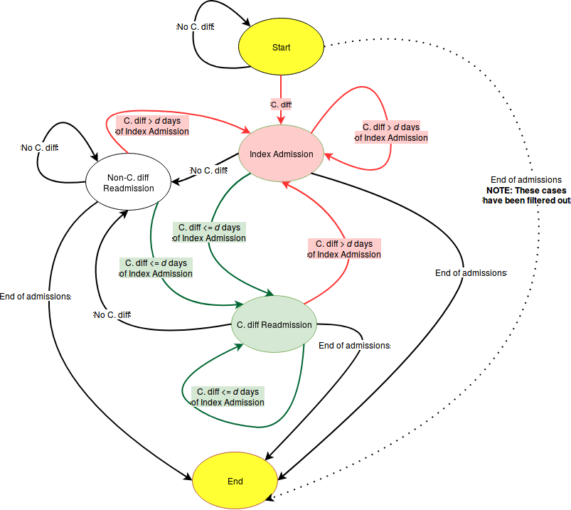

```{r, echo=FALSE, cache=FALSE, message=FALSE, warning=FALSE}
library("devtools")
library('MonetDB.R')
# install.packages('MonetDBLite')
library('MonetDBLite')
library('DBI')
library('ggplot2')
library('scales')
library('ggjoy')
library('ggridges')
library('reshape2')
library('modeest')
library('survey')
library('spatstat')
library('magrittr')
library('tidyverse')
library('broom')
library('dplyr')
library('beepr')
library('Hmisc')
library('e1071')
options(scipen=999)
options(survey.adjust.domain.lonely=TRUE)
options(survey.lonely.psu="remove")
knitr::opts_chunk$set(cache = TRUE, warning = FALSE,  message = FALSE, cache.lazy = FALSE)
```

<style>
div.cite {
  display: block;
  font-size: 0.6em;
  text-align: left;
}

div.blockquote {
  display: block;
  font-size: 0.6em;
  text-align: left;
}

div.equation {
  display: block;
  font-size: 0.6em;
  text-align: left;
}

/* Don't capitalize headers */
.reveal h1 {
  text-transform: none;
}

span.diff-title {
  text-transform: none;
  font-style: italic;
}

</style>

# Hello and thank you for coming!

## Alternative titles
- How to lose friends and infect people
- **Epidemiology!** For fun and for profit
- <div style="width:225px; margin:auto; display: block;">
  
</div>
- <div style="width:60px; display: inline-block;">
    
  </div>
  <div style="width:60px; display: inline-block;">
    
  </div>
  <div style="width:60px; display: inline-block;">
    
  </div>
  <div style="width:60px; display: inline-block;">
    
  </div>
  <div style="width:60px; display: inline-block;">
    
  </div>
  <div style="width:60px; display: inline-block;">
    
  </div>

## About me
 - University of Nebraska, Omaha
     - B.S. Computer Science and Mathematics (2009)
     - M.S. Mathematics, Data Science (May, 2018)
 - Software Engineer (2004-present)
 - Flight Operations, U.S. Army National Guard (2000-2009)
<div align="center" style="padding-top: 20px;">
  <div style="width:200px; height:200px; display: inline-block;">
  
  </div>
  <div style="width:200px; height:200px; display: inline-block;">
  
  </div>
  <div style="width:200px; height:200px; display: inline-block;">
  
  </div>
  <div style="width:200px; height:200px; display: inline-block;">
  
  </div>
</div>


## Agenda

1. Introduction and motivation
2. C. *diff* and renal failure
3. The data
4. Methodology
5. Results


# Introduction and motivation

## Why are we here?

## Pr(You)

- $Pr(\text{boy meets girl}) = \frac{1}{20000}$
- $Pr(\text{same boy knocks up same girl}) = \frac{1}{2000}$
- $Pr(\text{right sperm meets right egg})$ = 1 in 400 quadrillion
- $Pr(\text{lineage})$: 1 in $10^{45000}$
- $Pr(\text{you})$ = 1 in $10^{2685000}$

<div class="cite">
So what’s the probability of your existing?  It’s the probability of 2 million people getting together – about the population of San Diego – each to play a game of dice with trillion-sided dice. They each roll the dice, and they all come up the exact same number – say, 550,343,279,001.

A miracle is an event so unlikely as to be almost impossible.  By that definition, I’ve just shown that you are a miracle.

Benazir, A. [What are the chances of your coming into being?](http://blogs.harvard.edu/abinazir/2011/06/15/what-are-chances-you-would-be-born/) (2011)
</div>

## Data Science

  

## Big Data

- Volume
    - How big is BIG? Gigabytes? Petabytes? Exabytes?
- Velocity
    - Twitter averages 5,700 tweets/second 
<div class="cite">Kirkorian, R. *<a href="https://blog.twitter.com/engineering/en_us/a/2013/new-tweets-per-second-record-and-how.html">New Tweets per second record, and how!</a>* (2013)</div>
- Variety
    - Plain text, XML, JSON, video, audio, etc.
- And sometimes veracity
    - Questionable data quality

## Finding a project
- `r knitr::asis_output("\U1F6AB")` Union Pacific PTC data (2016-2017) - SCRAPPED
- `r knitr::asis_output("\U2705")` HCUP project through Creighton


  


# C. <span class="diff-title">diff</span> and renal failure

## C. <span class="diff-title">diff</span>
- Clostridium *difficile* 
- Gram-positive, anaerobic, rod-shaped, Endospore-forming bacterium
- Has surpassed MRSA as most common nosocomial (hospital-acquired) disease

<div style="width:400px; display: block; margin: auto;">
  
</div>


## Scientific Classification
+--------------------------+----------------------------+
| **Kingdom**              | Bacteria                   |
+--------------------------+----------------------------+
| **Phylum**               | Firmicutes                 |
+--------------------------+----------------------------+
| **Class**                | Clostridia                 |
+--------------------------+----------------------------+
| **Order**                | Clostridiales              |
+--------------------------+----------------------------+
| **Family**               | Clostridiaceae             |
+--------------------------+----------------------------+
| **Genus**                | Clostridium                |
+--------------------------+----------------------------+
| **Species**              | C. *difficile*             |
+--------------------------+----------------------------+

## Where it lives
- Intestinal tract of healthy people 
    - 13.6% of children, 5.5% of adults are colonized
<div class="cite">Tetro, J. <a href="https://www.popsci.com/clostridium-difficile-is-more-common-than-you-think">Clostridium difficile Is More Common Than You Think</a> (2016)</div>
    - 70% of infants < 10-12 months old carry C. *diff*
<div class="cite">Lamont, T. *C. diff in 30 Minutes.*</a> (2017)</div>
- Soil
- Water
- Feces of infected animals and humans
- Surfaces for up to 5 months

## Signs / Symptoms
- Diarrhea
- Fever
- Nausea
- Abdominal pain
- Pseudomembranous colitis
- Toxic megacolon
- Perforation of the colon
- Sepsis

## CDI risk
<div style="width:1000px; display: block; margin: auto;">
  
</div>
<div class="cite"><a href="https://www.cdc.gov/hai/pdfs/cdiff/CDiff-One-Pager.pdf">CDC</a></div>

## How CDI spreads
<div style="width:1000px; display: block; margin: auto;">
  
</div>
<div class="cite"><a href="https://www.cdc.gov/hai/pdfs/cdiff/CDiff-One-Pager.pdf">CDC</a></div>

## CDI treatments

- Antibiotics
    - Flagyl (metronidazole) - Cheap, no longer recommended
    - Vanco (vancomycin) - Expensive but effective
    - Dificid (fidaxomicin) - Most expensive, most effective
<div class="cite">Louie, T., et. al. *Fidaxomicin versus Vancomycin for Clostridium difficile Infection.* (2011)</div>
- Fecal Microbiota Transplants (FMT)
    - via ng-tube or colonoscopy (similar outcomes)
<div class="cite">Postigo, R. and Kim, J.H. *Colonoscopic versus nasogastric fecal transplantation for the treatment of Clostridium difficile infection: a review and pooled analysis.* (2012)</div>
    - via OpenBiome capsules
- Probiotics are not recommended
    
      
## Renal (kidney) disease
- Acute kidney injury (AKI)
- Chronic kidney disease
    - Stages 1-4
- Stage 5 - End-stage renal disease (ESRD)
- Dialysis or transplant

## Renal disease signs / symptoms

- Nausea
- Vomiting
- Loss of appetite
- Fatigue and weakness
- Sleep problems
- Changes in urine volume
- ...much more

## Renal disease treatments

- Treat the underlying cause

## AKI Causes
- Decreased blood flow
- Direct damage to kidneys
- Urinary tract blockage

## AKI Risks

- Hospitalization
- Advanced age
- Blood vessel blockage in arms/legs
- Diabetes
- High blood pressure
- Heart failure
- Kidney diseases
- Liver diseases
<div class="cite"><a href="https://www.mayoclinic.org/diseases-conditions/kidney-failure/symptoms-causes/syc-20369048">Mayo Clinic</a></div>

## CKD Causes
- Type I/II diabetes
- High blood pressure
- ...much more

## CKD risk

- Cardiovascular disease
- Smoking
- Obesity
- Race
    - African-, Native-, or Asian-American
- Family history of kidney disease
- Abnormal kidney structure
- Older age
<div class="cite"><a href="https://www.mayoclinic.org/diseases-conditions/chronic-kidney-disease/symptoms-causes/syc-20354521">Mayo Clinic</a></div>

## Measuring kidney function 
- Glomerular Filtration Rate (GFR)
- MDRD
<div class="equation">
$$
  GFR = 175 \times S_{cr} - 1.154 \times \text{Age}^{-0.203} \times 0.742 \cdot I(\text{F}) \times 1.212 \cdot I(\text{AA})
$$
</div>
- CKD-EPI
<div class="equation">
$$
  GFR = 141 \times min\bigg(\frac{S_{cr}}{\kappa}, 1\bigg)^{\alpha} \times max\bigg(\frac{S_{cr}}{\kappa}, 1\bigg)^{-1.209} \\
  \times 0.993^{\text{Age}} \times 1.018 \cdot \text{I}(\text{F}) \times 1.159 \cdot \text{I}(\text{AA})
$$
</div>

<div class="blockquote">
- F is female sex
- AA is African American race
- I is 1 if true, else reciprocal of preceding term 
- $S_{cr}$ is serum creatinine in mg/dL
- $\kappa$ is 0.7 for females and 0.9 for males
- $\alpha$ is -0.329 for females and -0.411 for males
</div>

## CKD Stages

+--------------------------+----------------------------+-----------------------+
| Stage                    | Description                | GFR/Kidney Function   |
+==========================+============================+=======================+
| 1                        | Normal function            | 90+/90%+              |
+--------------------------+----------------------------+-----------------------+
| 2                        | Mild loss                  | 60-89/60-89%          |
+--------------------------+----------------------------+-----------------------+
| 3                        | Mild to severe             | 30-59/30-59%          |
+--------------------------+----------------------------+-----------------------+
| 4                        | Severe                     | 15-29/15-29%          |
+--------------------------+----------------------------+-----------------------+
| 5                        | Kidney failure (ESRD)      | 15 or less/15% or less|
+--------------------------+----------------------------+-----------------------+


## End-stage renal disease (ESRD)

- When stage 5 is reached
- Dialysis or kidney transplant


## Readmissions

- If hospital has "excess readmissions", penalties are assessed
- 30-day risk standardized measure to calculate Payment Readjustment Factor (PRF)
<div class="blockquote">
  All-cause unplanned readmissions to the same or another applicable acute care hospital, 
  occurring within 30 days - for any reason, regardless of principal diagnosis - from the index admission are counted in this measure.
  Some planned readmissions are not counted. 
  <a href="https://www.cms.gov/Medicare/Quality-Initiatives-Patient-Assessment-Instruments/Value-Based-Programs/HRRP/Hospital-Readmission-Reduction-Program.html">HRRP</a>
</div>
<div class="equation">
$$
  \text{PRF} = 1 - min\bigg(0.03, \sum_{dx} \frac{\text{Payment}(dx) \cdot max\big((\text{ERR}(dx) - 1.0), 0\big)}{\text{All payments}}\bigg)
$$ 
</div>
- Where $dx$ is one of six measure cohorts, incl heart failure, pneumonia, et. al.
- ERR is a hospital's performance measure $dx$, and payment refers to base operating DRG payments. \cite{HRRPPaymentAdjustment, Lessa2015}


# The data


## A fun experiment
- Step 1: Pick a random percentage. e.g. 54%, 28%, 77%, etc.
- Step 2: Type that number into Google followed by "of Americans"
- Step 3: Follow rabbit hole for hours

## 
  <div style="width:600px; height:800px; display: inline-block;">
  
  </div>


## Simple random sample
- Pólya urn model
- With (SRSWR) or Without Replacement (SRSWOR)
    - With replacement - makes use of i.i.d. assumption
    - Without replacement - not i.i.d. but still exchangeable
- Requires access to the entire population

  <div style="width:200px; height:200px; display: inline-block;">
  
  </div>
  
<div class="notes">
So how do we come to these conclusions? Well, we could do a Simple Random Sample.

Polya Urn Models. This is what you learn in Prob Stat I and II. It can either be with
or without replacement. With replacement maintains i.i.d. assumptions so all of our 
nice statistical techniques can be used. If we do it without replacement, we lose 
our i.i.d. assumption, but we still have exchangeability, so, for instance, Bayesian
models only rely on exchangeability, rather than i.i.d.
</div>


## Sampling design

+--------------------------+----------------------------+-----------------------+
| Sampling Plan            | **Design-based inference** | Model-based inference |
+==========================+============================+=======================+
| **Probability sample**   | **A**                      | C                     |
+--------------------------+----------------------------+-----------------------+
| Model-dependent sample   | B                          | D                     |
+--------------------------+----------------------------+-----------------------+
| Quota sampling           | E                          | F                     |
+--------------------------+----------------------------+-----------------------+
| Convenience sampling     | G                          | H                     |
+--------------------------+----------------------------+-----------------------+
| Snowball sampling        | I                          | J                     |
+--------------------------+----------------------------+-----------------------+
| Peer nomination          | K                          | L                     |
+--------------------------+----------------------------+-----------------------+

<div class="notes">
  When we talk about survey sample design or sampling strategy, 
  we're talking about two components: 
  A sampling plan, and a method for drawing inferences from that sample. 
 
  There are essentially two main sampling plan approaches: Probability sampling
  plans and non-probability sampling plans. 
  
  Cells A and D are natural pairings, but it is not uncommon to find the 
  hybrid approaches of B and C in survey research. We're seeing more and more
  model-based inference - which you can think of as primarily Bayesian models - 
  with Nate Silver and FiveThirtyEight, or Nate Cohn and the NYT. It is becoming
  more and more common to run model-based inference on probability samples.
  
  However, most research is still done with design-based inference. 
  
  A probability sampling plan assigns non-zero probabilities of selection
  to each member of the sampling frame. Sample choices are then randomized.
  
  Model-dependent sampling plans, on the other hand, assume the statistics of interest
  follow a known probability distribution. They then seek to draw samples that maximize
  the precision (or minimize the variance) of estimation for the statistics of interest.
  
  These are not common in survey practice. Surveys are generally intended to be multi-purpose,
  and if the wrong model is used, it can lead to biased estimates. 
  
  Design-based inference is non-parametric, in that it only relies on the probability
  of each observation's inclusion. 
  
  Model-based inference is based on a probability distribution for the random variable
  of interest.
</div>


## Design effects

```{r, echo=FALSE, cache=TRUE, fig.height=5, fig.width=6}
std.err.p <- c(0.030, 0.020, 0.015, 0.010, 0.008, 0.007, 0.0065, 0.0064, 0.00635, 0.00635, 0.0063)
sample.size <- c(100, seq(250, 2500, by=250))
data.frame(std.err.p, sample.size) %>%
  ggplot(aes(sample.size, std.err.p)) +
    geom_smooth(method="loess", se=FALSE) +
    labs(title="Tug-of-war between Stratification and Clustering/Weighting", x="Sample size", y="Standard error of P") +
    annotate("text", x = 600, y = 0.022, label = sprintf('\u21E7'), size=48) +
    annotate("text", x = 600, y = 0.022, label = "Cluster sampling", size=4, angle=90)  +
    annotate("text", x = 1000, y = 0.020, label = sprintf('\u21E7'), size=48) +
    annotate("text", x = 1000, y = 0.020, label = "Weighting", size=4, angle=90) +
    annotate("text", x = 250, y = 0.015, label = sprintf('\u21E9'), size=48) +
    annotate("text", x = 250, y = 0.015, label = "Stratification", size=4, angle=90) +
    annotate("text", x = 1500, y = 0.025, label = "Loss (L_cluster, L_weighting)", size=4) +
    annotate("text", x = 250, y = 0.009, label = "Gain (G_strat)", size=4) 
```

<div class="notes">
  Complex survey designs make use of stratification, clustering, and/or weighting. 
</div>

## Design effects

  - "deft"
  - Similar to variance inflation factor (VIF)
  - Effective sample size
  
  $$
  D^2(\hat{\theta}) = \frac{SE(\hat{\theta})^2_{complex}}{SE(\hat{\theta})^2_{srs}} = \frac{var(\hat{\theta})_{complex}}{var(\hat{\theta})_{srs}}
  $$
  
  $$
  n_{eff} = \frac{n_{complex}}{d^2(\hat{\theta})}
  $$
  

## Clustering
- Grouping people by geographic regions
- SRS to choose a geographic region
  <div style="width:500px; height:500px; margin: auto; display: block;">
  
  </div>

## Clustering
  <div style="width:500px; height:500px; margin: auto; display: block;">
  
  </div>

## Stratification
  <div style="width:500px; height:500px; margin: auto; display: block;">
  
  </div>
  
## Stratification
  <div style="width:500px; height:500px; margin: auto; display: block;">
  
  </div>
  
<div class="notes">
</div>

## Weighting
- $N = 51$
  <div style="width:500px; height:500px; margin: auto; display: block;">
  
  </div>
  
<div class="notes">
</div>

## Weighting
- $N_{men} = 30$
- $p_{men} = \frac{30}{51} = 0.588$
  <div style="width:500px; height:500px; margin: auto; display: block;">
  
  </div>
  
<div class="notes">
</div>

## Weighting
- $N_{women} = 21$
- $p_{women} = \frac{21}{51} = 0.412$
  <div style="width:500px; height:500px; margin: auto; display: block;">
  
  </div>
  
## Weighting
- $N_{women} = 21$
- Women Odds Ratio: $\frac{p_{women}}{p_{men}} = \frac{0.588}{0.412} = 1.427$
- Men Odds Ratio: $\frac{p_{men}}{p_{women}} = \frac{0.412}{0.588} = 0.701$
  
<div class="notes">
</div>

## H-CUP Databases
- Healthcare Cost and Utilization Project
- Includes NIS and NRD
- Must be purchased
- Data usage agreement required for analysts

## NIS Sampling Design
- Nationwide Inpatient Sample
    - 1988-2011: 100% sample of 20% of HCUP hospitals
- National Inpatient Sample
    - 2012-present: 20% sample of 100% of HCUP hospitals

<div class="notes">
  In the NIS, each element of the population is associated with a hospital. A
  sample of the hospitals is drawn, and then a sample within each selected hospital 
  is drawn.
</div>

## HCUP Complex Survey Design
- Clustered on hospital ID
- Weights included in `discwt` field for national estimates
- 1988-2011: Stratified by census region and bed size
- 2012-present: Stratified by census division and bedside
<div style="font-size: 50%">
    - Region 1 (Northeast)
        - Division 1 (New England)
        -Division 2 (Mid Atlantic)
    - Region 2 (Midwest)
        - Division 3 (East North Central)
        - **Division 4 (West North Central) (incl. Nebraska)**
    - Region 3 (South)
        - Division 5 (South Atlantic)
        - Division 6 (East South Central)
        - Division 7 (West South Central)
    - Region 4 (West)
        - Division 8 (Mountain)
        - Division 9 (Pacific)
</div>

## Importance of survey design

- Treating as SRS

```{r readdata, message=FALSE, warning=FALSE, echo=FALSE, cache=TRUE}
cdiff <- read_csv('../data/cdiff.csv')
cdiff <- filter(cdiff, !is.na(los))
cdiff <- filter(cdiff, !is.na(age))
# Exclude patients who died
cdiff <- filter(cdiff, died == 0)
cdiff <- filter(cdiff, nis_year == 2011)
srs.fit <- lm(los~age, data=cdiff)

```

```{r srs, echo=TRUE, cache=TRUE}

summary(lm(los~age, data=cdiff))
```

## Importance of survey design

- Accounting for survey design with R survey package
```{r complex_fit, echo=FALSE, warning=FALSE, cache=TRUE}

library('survey')
cdiff <- filter(cdiff, nis_year == 2011)
cdiff.design <- svydesign(ids = ~hospid, data = cdiff, weights = ~discwt,  strata = ~nis_stratum, nest=TRUE)
complex.fit <- svyglm(los~age, design=cdiff.design)
```


```{r complex, echo=TRUE, warning=FALSE, cache=TRUE}
library('survey')

cdiff.design <- svydesign(ids = ~hospid, data = cdiff, weights = ~discwt,  strata = ~nis_stratum, nest=TRUE)
summary(svyglm(los~age, design=cdiff.design))
```

##  SRS vs. complex design
```{r srs_plot, echo=FALSE, warning=FALSE, message=FALSE, cache=TRUE, fig.height=5, fig.width=5, fig.cap="SRS line in red, complex design in blue"}

ggplot(cdiff, aes(age, los)) +
  geom_smooth() +
  geom_abline(slope = srs.fit$coefficients[[2]], intercept = srs.fit$coefficients[[1]], col="red") +
  geom_abline(slope = complex.fit$coefficients[[2]], intercept = complex.fit$coefficients[[1]], col="blue") +
  labs(title="Length of stay vs. Age for 2011 C. diff patients") 
```

## Research design checklist
<div class="blockquote">
  - Only detect disease conditions, procedures, and diagnostic tests in hospital settings
  - "Encounters" not patients
  - No volume-specific assessments for:
      - Geographic units, like U.S. states
      - Healthcare facilities (after 2011)
      - Individual health care providers
  - Determine diseases and procedures using validated administrative codes
  - Limit assessment to in-hospital outcomes
  - Distinguish between complications and comorbidities or state where you cannot
  - Account for NIS/NRD survey design
  - Address changes in data structure over time for trend analysis
</div>

<div class="cite">Khera, R. and Krumholz, M. *With Great Power Comes Great Responsibility: Big Data Research From the National Inpatient Sample.* (2017)</div>

## NIS Features
```{r, fig.height=4, fig.width=4, error=FALSE, warning=FALSE, message=FALSE, echo=FALSE}
library('tidyverse')
library('stringr')

df <- data_frame(year=2000, features=0)
for (y in 2001:2014) {
  new.df <- data_frame(year=y, features=sum((readLines(paste0('/home/bdetweiler/src/Data_Science/stat-8960-capstone-project/data/headers-nis', y, '.txt')) %>% 
                                               unique() %>% 
                                               str_length()) > 0))
  df <- bind_rows(df, new.df)
}
df <- df %>% filter(year > 2000)
df %>%
  ggplot(aes(year, features)) +
    geom_point() +
    geom_line() +
    labs(x="Year", y="Features", title="NIS Features (columns)")
  
```

- 2009 - Added DX and DXCCS codes 16-25
- 2012 - NIS redesign (removed hospital-specific features)
- 2014 - Added DX and DXCCS codes 26-30


## NIS dimensions
- Big data?
- Definitely **large** data
- ~3 GB per year (raw CSV)
- 108,683,763 total rows
- `r 108683763/10` per year

## NRD Features

- Years 2010-2013 had 116 features
- 2014 had 126 features
    - Added DX and DXCCS 26-30
- ~10 GB per year (raw CSV)
- 87,699,909
- `r 87699909/5` per year

## Features of interest
- Age
- Female
- Length of Stay
- Died
- Hospital categorization
- DXn codes (ICD-9-CM codes)
    - C. diff - **00845**
    - AKI - **584, 584.5-584.9**
    - CKD - **585, 585.1-585.6, 585.9**
    - Renal Failure, unspecified - **586**


# Methodology

## Dealing with big data

<div style="width:300px; margin: auto; display: block;">
  
</div>
- Column-store relational database
    - Data warehouse


## Getting data into the database
- Lots of Excel work 
<div style="width: 60px; display: inline-block;">
  
</div>

- NIS CSV: ~3GB
- read_csv(...**NIS**...): ~64 GB in RAM
- NRD CSV: ~6GB
- read_csv(...**NRD**...): CRASHED
    - Had to split data 


## Getting data back out

    SELECT *
      FROM nis
     WHERE nis.dx1  = '00845' 
        OR nis.dx2  = '00845' 
        OR nis.dx3  = '00845' 
        OR nis.dx4  = '00845' 
        OR nis.dx5  = '00845' 
        OR nis.dx6  = '00845' 
        OR nis.dx7  = '00845' 
        OR nis.dx8  = '00845' 
        OR nis.dx9  = '00845' 
        OR nis.dx10 = '00845' 
        OR nis.dx11 = '00845' 
        OR nis.dx12 = '00845' 
        OR nis.dx13 = '00845' 
        OR nis.dx14 = '00845' 
        OR nis.dx15 = '00845'
        OR nis.dx16 = '00845' 
        OR nis.dx17 = '00845' 
        OR nis.dx18 = '00845' 
        OR nis.dx19 = '00845' 
        OR nis.dx20 = '00845' 
        OR nis.dx21 = '00845' 
        OR nis.dx22 = '00845' 
        OR nis.dx23 = '00845' 
        OR nis.dx23 = '00845' 
        OR nis.dx25 = '00845' 
        OR nis.dx26 = '00845' 
        OR nis.dx27 = '00845' 
        OR nis.dx28 = '00845' 
        OR nis.dx29 = '00845'
        OR nis.dx30 = '00845'
    
## Readmissions

- **nrd_visitlink** allows analyst to link visits
- **los** and **nrd_daystoevent** used to determine sequence and length of stay
- Up to analyst to determine "index" admission and readmissions


##

<div style="width:900px; margin: auto; display: block;">
  
</div>

## Other considerations

- 2010-2014: (1 ≤ DMONTH ≤ 12 − ceil(d/30))
    - Cut off index events with enough time to track readmissions
- DIED $\ne$ 0
    - A death on index does not allow for readmission
- Length of stay > 0
    - LOS == zero represents transfers and same-day stays (more complex)
- AGE > 0
    - Infants are often asymptomatic carriers of  C. *diff*

## Models

- Linear logistic regression
- Start with all C. *diff* patients
- Fit each year separately
    - Accounts for changes in years
    - Allowed fitting to complete under hardware limitations

<div class="blockquote">
    readmitted ~ hosp_hcontrl_govt +
                 hosp_hcontrl_priv_np +
                 hosp_urcat4 +
                 hosp_ur_teach_metro +
                 hosp_ur_teach_metro_teaching +
                 hosp_bedsize +
                 female +
                 acute_kidney_failure +
                 chronic_kidney_disease2 +
                 chronic_kidney_disease3 +
                 chronic_kidney_disease4 +
                 chronic_kidney_disease5 +
                 chronic_kidney_disease6 +
                 chronic_kidney_disease_unk +
                 renal_failure_unspecified
 </div> 


# Results

```{r, include=FALSE}
#setwd('/home/bdetweiler/src/Data_Science/stat-8960-capstone-project/thesis')
# guess_max set the the number of rows means it makes no guesses about the data types and hence has no chance to get them wrong
cdiff <- read_csv('../data/cdiff.csv', guess_max = 858204)

readm.30 <- read_csv('../data/cdiff-readmissions-30-day-window.csv')

readm.60 <- read_csv('../data/cdiff-readmissions-60-day-window.csv')

readm.90 <- read_csv('../data/cdiff-readmissions-90-day-window.csv')
```

## Trends
```{r, echo=FALSE}
proportions <- read_csv('../data/proportions.csv')
proportions <- filter(proportions, year > 2000)

# Sort by highest proportion in our last year, 2014
in.order <- proportions %>% 
  filter(year == 2014) %>%
  arrange(desc(theta)) %>%
  pull(disease) 
proportions$disease <- factor(proportions$disease, levels=in.order)

cdi.theta.2001 <- proportions %>% filter(disease == 'cdi' & year == 2001) %>% pull(theta)
cdi.theta.2001.2.5 <- proportions %>% filter(disease == 'cdi' & year == 2001) %>% pull(ci2.5)
cdi.theta.2001.97.5 <- proportions %>% filter(disease == 'cdi' & year == 2001) %>% pull(ci97.5)

cdi.2001.people <- round(cdi.theta.2001 * 35400000)
cdi.2001.people.2.5 <- round(cdi.theta.2001.2.5 * 35400000)
cdi.2001.people.97.5 <- round(cdi.theta.2001.97.5 * 35400000)

cdi.theta.2014 <- proportions %>% filter(disease == 'cdi' & year == 2014) %>% pull(theta)
cdi.theta.2014.2.5 <- proportions %>% filter(disease == 'cdi' & year == 2014) %>% pull(ci2.5)
cdi.theta.2014.97.5 <- proportions %>% filter(disease == 'cdi' & year == 2014) %>% pull(ci97.5)

cdi.2014.people <- round(cdi.theta.2014 * 35400000)
cdi.2014.people.2.5 <- round(cdi.theta.2014.2.5 * 35400000)
cdi.2014.people.97.5<- round(cdi.theta.2014.97.5 * 35400000)

delta <- cdi.theta.2014 - cdi.theta.2001

delta.people <- round(delta * 35400000)

cdi.dat <- proportions %>%
  filter(disease == 'cdi')

fit <- lm(theta~year, data=cdi.dat)
fit2.5 <- lm(ci2.5~year, data=cdi.dat)
fit97.5 <- lm(ci97.5~year, data=cdi.dat)
 
est.2015 <- (tidy(summary(fit)$coefficients)[1,2] + 2015 * tidy(summary(fit)$coefficients)[2,2]) * 35400000
est.2015.2.5 <- (tidy(summary(fit2.5)$coefficients)[1,2] + 2015 * tidy(summary(fit2.5)$coefficients)[2,2]) * 35400000
est.2015.97.5 <- (tidy(summary(fit97.5)$coefficients)[1,2] + 2015 * tidy(summary(fit97.5)$coefficients)[2,2]) * 35400000

proportions %>%
  filter(disease == 'cdi') %>%
  ggplot(aes(x = year, y = theta)) +
    geom_errorbar(aes(ymin=ci2.5, ymax=ci97.5), colour="black", width=.1) +
    geom_line() +
    xlim(2001, 2018) +
    stat_smooth(method="lm", fullrange=TRUE) +
    geom_point(size=1) +
    labs(title="Inpatient CDI trends", x="Year", y="Proportion of inpatients")
```

## Trends
```{r, echo=FALSE}
# Since AKI is a combination of multiple codes, we should combine CKD codes as well
proportions <- read_csv('../data/proportions.csv')
proportions <- filter(proportions, year > 2000)

ckd <- proportions %>% 
  filter(disease %in% c("ckd", "ckd1", "ckd2", "ckd3", "ckd4", "ckd5")) %>%
  group_by(year) %>%
  summarise(theta=sum(theta), ci2.5=sum(ci2.5), ci97.5=sum(ci97.5)) %>%
  mutate(disease=rep(factor("chronic_kidney_disease"), 14))

proportions <- bind_rows(proportions, ckd)

proportions <- proportions %>%
  filter(disease %in% c('chronic_kidney_disease', "aki", "ckd6", "cdi")) %>%
  mutate(disease=replace(disease, disease=="chronic_kidney_disease", "CKD")) %>%
  mutate(disease=replace(disease, disease=="aki", "AKI")) %>%
  mutate(disease=replace(disease, disease=="ckd6", "ESRD")) %>%
  mutate(disease=replace(disease, disease=="cdi", "CDI")) 

in.order <-
  proportions %>% 
  filter(year == 2014) %>%
  arrange(desc(theta)) %>% 
  pull(disease) 

proportions$disease <- factor(proportions$disease, levels=in.order)

proportions %>%
  ggplot(aes(x = year, y = theta, colour=disease)) +
    geom_errorbar(aes(ymin=ci2.5, ymax=ci97.5), colour="black", width=.1) +
    geom_line() +
    geom_point(size=1) +
    labs(title="CDI and Renal Failure trends", x="Year", y="Proportion of inpatients")

aki.change <- proportions %>% 
  filter(disease == 'AKI') %>% 
  pull(theta) %>% 
  diff(lag = 1) %>% 
  mean() * 100
 
aki.change2.5 <- proportions %>% 
  filter(disease == 'AKI') %>% 
  pull(ci2.5) %>% 
  diff(lag = 1) %>% 
  mean() * 100
aki.change2.5 <- round(aki.change2.5, digits = 3) 

aki.change97.5 <- proportions %>% 
  filter(disease == 'AKI') %>% 
  pull(ci97.5) %>% 
  diff(lag = 1) %>% 
  mean() * 100
aki.change97.5 <- round(aki.change97.5, digits = 3) 

ckd.change <- proportions %>% 
  filter(disease == 'CKD') %>% 
  pull(theta) %>% 
  diff(lag = 1) %>% 
  mean() * 100
 
ckd.change2.5 <- proportions %>% 
  filter(disease == 'CKD') %>% 
  pull(ci2.5) %>% 
  diff(lag = 1) %>% 
  mean() * 100
ckd.change2.5 <- round(ckd.change2.5, digits = 3) 

ckd.change97.5 <- proportions %>% 
  filter(disease == 'CKD') %>% 
  pull(ci97.5) %>% 
  diff(lag = 1) %>% 
  mean() * 100
ckd.change97.5 <- round(ckd.change97.5, digits = 3) 

ckd.change <- proportions %>% 
  filter(disease == 'CKD') %>% 
  pull(theta) %>% 
  diff(lag = 1) %>% 
  mean() * 100
 
ckd.change2.5 <- proportions %>% 
  filter(disease == 'CKD') %>% 
  pull(ci2.5) %>% 
  diff(lag = 1) %>% 
  mean() * 100
ckd.change2.5 <- round(ckd.change2.5, digits = 3) 

ckd.change97.5 <- proportions %>% 
  filter(disease == 'CKD') %>% 
  pull(ci97.5) %>% 
  diff(lag = 1) %>% 
  mean() * 100
ckd.change97.5 <- round(ckd.change97.5, digits = 3) 
```

## Trends
```{r, echo=FALSE}
df <- read_csv('../data/esrd.csv')
ggplot(df, aes(x = age, y = nis_year, group = nis_year)) + 
  geom_density_ridges(aes(height=..density..), stat="density") +
  labs(title="ESRD distribution by age over time", x="Age", y="Year")
```

## Trends
```{r, echo=FALSE}
cdiff %>% 
  filter(!is.na(age)) %>% 
  select(age, nis_year) %>%
  ggplot(aes(x = age, y = nis_year, group = nis_year)) + 
    #geom_joy(stat = "identity")
    geom_density_ridges() +
    labs(title="CDI distribution by age over time", x="Age", y="Year")
```

## Trends
```{r, echo=FALSE}
ages <- cdiff %>% filter(!is.na(age)) %>% select(age)
mode <- mlv(ages$age, method = "mfv")
q25 <- quantile(ages$age, 0.25)
q75 <- quantile(ages$age, 0.75)
xbar <- mean(ages$age)
med <- median(ages$age)

cdiff.by.age.and.year <- cdiff %>% 
  filter(!is.na(age)) %>% 
  select(age, nis_year)

years <- cdiff.by.age.and.year %>% 
  select(nis_year) %>% 
  unique() %>% 
  pull(nis_year)

y <- years[1]
skew <- list()
kurt <- list()
for (y in years) {
  cdiff.by.age <- cdiff.by.age.and.year %>% 
    filter(nis_year == y) %>% 
    pull(age)
  
  skew[[y]] <- skewness(cdiff.by.age)  
  kurt[[y]] <- kurtosis(cdiff.by.age) 
}

data.frame(year=years, skewness=unlist(skew), kurtosis=unlist(kurt)) %>%
  ggplot(aes(x=year, y=skewness)) +
    geom_line(stat="identity", col="red") +
    geom_line(aes(x=year, y=kurtosis), col="blue") +
    labs(title="Skewness and Kurtosis of age distribution", x="Year", y="Skewness (red), Kurtosis (blue)")

```

## Trends

```{r, echo=FALSE}
df <- read_csv('../data/ages_quantiles.csv')
df <- filter(df, year > 2000)
df %>%
  filter(disease == 'cdi') %>%
  ggplot(aes(x = year, y = theta50)) +
    geom_errorbar(aes(ymin=theta50_2.5, ymax=theta50_97.5), colour="black", width=.1) +
    geom_line(aes(ymin=65, ymax=75)) +
    #scale_y_discrete(labels=factor(seq(65, 75, by=1))) +
    geom_point(size=1) +
    labs(title="Inpatient Median Age Trends", x="Year", y="Age")

```


## Trends

```{r, echo=FALSE}
ts.by.year <- readRDS('../data/cdi_ages_ts.rds')

plot.ts <- data.frame(year=2001:2014)
plot.ts <- cbind(plot.ts, data.frame('0_5'=ts.by.year[['0_5']]))
plot.ts <- cbind(plot.ts, data.frame('5_10'=ts.by.year[['5_10']]))
plot.ts <- cbind(plot.ts, data.frame('10_15'=ts.by.year[['10_15']]))
plot.ts <- cbind(plot.ts, data.frame('15_20'=ts.by.year[['15_20']]))
plot.ts <- cbind(plot.ts, data.frame('20_25'=ts.by.year[['20_25']]))
plot.ts <- cbind(plot.ts, data.frame('25_30'=ts.by.year[['25_30']]))
plot.ts <- cbind(plot.ts, data.frame('30_35'=ts.by.year[['30_35']]))
plot.ts <- cbind(plot.ts, data.frame('35_40'=ts.by.year[['35_40']]))
plot.ts <- cbind(plot.ts, data.frame('40_45'=ts.by.year[['40_45']]))
plot.ts <- cbind(plot.ts, data.frame('45_50'=ts.by.year[['45_50']]))
plot.ts <- cbind(plot.ts, data.frame('50_55'=ts.by.year[['50_55']]))
plot.ts <- cbind(plot.ts, data.frame('55_60'=ts.by.year[['55_60']]))
plot.ts <- cbind(plot.ts, data.frame('60_65'=ts.by.year[['60_65']]))
plot.ts <- cbind(plot.ts, data.frame('65_70'=ts.by.year[['65_70']]))
plot.ts <- cbind(plot.ts, data.frame('70_75'=ts.by.year[['70_75']]))
plot.ts <- cbind(plot.ts, data.frame('75_80'=ts.by.year[['75_80']]))
plot.ts <- cbind(plot.ts, data.frame('80_85'=ts.by.year[['80_85']]))
plot.ts <- cbind(plot.ts, data.frame('85_90'=ts.by.year[['85_90']]))
plot.ts <- cbind(plot.ts, data.frame('90_95'=ts.by.year[['90_95']]))

plot.ts.m <- melt(plot.ts, id.vars=c('year'))

labels <- gsub('_', '-', gsub('X', replacement = '', as.character(plot.ts.m$variable)))
plot.ts.m$variable <- factor(labels, levels = unique(labels))

cols <- c('0-5'   = "#e6e6ff",
          '5-10'  = "#ccccff",
          '10-15' = "#b3b3ff",
          '15-20' = "#9999ff",
          '20-25' = "#8080ff",
          '25-30' = "#6666ff",
          '30-35' = "#4d4dff",
          '35-40' = "#3333ff",
          '40-45' = "#1a1aff",
          '45-50' = "#0000ff",
          
          # RED - increasing 
          '50-55' = "#cc0000",
          '55-60' = "#b30000",
          '60-65' = "#990000",
          '65-70' = "#800000",
          '70-75' = "#660000",
          
          # GREEN - Somewhat decreasing
          '75-80' = "#006600",
          '80-85' = "#004d00",
          '85-90' = "#008000",
          '90-95' = "#003300",
          
          '95-100' = "#000000")
plot.ts.m %>% 
  ggplot(aes(x=year, y=value, colour=variable)) +
    geom_line() +
    scale_colour_manual(values = cols) +
    labs(title="Time series of CDI cases by 5-year age groups", x="Year", y="Estimated Cases", colour="Ages")
```


## Trends
```{r, echo=FALSE}
df <- read_csv('../data/cdi-male-female.csv')

mean.female.ratio <- df %>% pull(prop) %>% mean()

df %>%
  rename(Female=tot.female, Male=tot.male) %>%
  select(year, Female, Male) %>%
  melt(id.vars=c('year')) %>%
  ggplot(aes(x = year, y = value, colour=variable)) +
    geom_line() +
    stat_smooth(method="loess") +
    labs(title="CDI in Males vs. Females", x="Year", y="Estimated Infections")
```


## Model fit

```{r, echo=FALSE}
sig.factor <- factor(c('HIGH', 'MID', 'LOW', 'NONE'), levels=c('HIGH', 'MID', 'LOW', 'NONE'))


df <- data.frame(year=2009,
                 readmission.day=0,
                 name=NA,
                 est=NA,
                 significance=NA,
                 se=NA,
                 t=NA,
                 p=NA)

readmission.day <- 90
for (readmission.day in c(30, 60, 90)) {
 
  models <- readRDS(paste0('../data/', readmission.day, 'dayreadmissionmodels.rds'))
  
  y <- 2010 
  for (y in seq(2010, 2014, by=1)) {
  
    fit <- models[[y]]
  
    fit.coef <- summary(fit)$coefficients
    
    fit.coef <- tidy(fit.coef) %>% rename(name=.rownames, est=Estimate, se=Std..Error, t=t.value, p=Pr...t..)
    fit.coef <- fit.coef %>%
      mutate(year=y) %>%
      mutate(significance=ifelse(p < 0.0001, 'HIGH', ifelse(p < 0.002, 'MID', ifelse(p < 0.02, 'LOW', 'NONE')))) %>%
      mutate(readmission.day=readmission.day)
  
   
    df <- fit.coef %>% 
      select(year, readmission.day, name, est, significance, se, t, p) %>% 
      bind_rows(df) %>%
      filter(year > 2009)

  }

}

df <- df %>% 
  mutate(name=replace(name, name=='chronic_kidney_disease1', 'CKD1')) %>%
  mutate(name=replace(name, name=='chronic_kidney_disease2', 'CKD2')) %>%
  mutate(name=replace(name, name=='chronic_kidney_disease3', 'CKD3')) %>%
  mutate(name=replace(name, name=='chronic_kidney_disease4', 'CKD4')) %>%
  mutate(name=replace(name, name=='chronic_kidney_disease5', 'CKD5')) %>%
  mutate(name=replace(name, name=='chronic_kidney_disease6', 'ESRD')) %>%
  mutate(name=replace(name, name=='chronic_kidney_disease_unk', 'CKD?')) %>%
  mutate(name=replace(name, name=='renal_failure_unspecified', 'RF?')) %>%
  mutate(name=replace(name, name=='acute_kidney_failure', 'AKI')) %>%
  mutate(name=replace(name, name=='hosp_hcontrl_govt', 'Hosp_Govt')) %>%
  mutate(name=replace(name, name=='hosp_hcontrl_priv_np', 'Hosp_NP')) %>%
  mutate(name=replace(name, name=='hosp_urcat4', 'Metro_Size')) %>%
  mutate(name=replace(name, name=='hosp_ur_teach_metro_teaching', 'Hosp_Teach')) %>%
  mutate(name=replace(name, name=='hosp_ur_teach_metro', 'Hosp_Urban')) 

# Filter only those that had a significant effect all 5 years
  df <- df %>%
    filter(name %in% c('AKI', 'CKD?', 'CKD3', 'CKD4', 'ESRD'))
 
  df %>%
    filter(significance != 'NONE') %>%
    filter(name != '(Intercept)') %>%
    group_by(name, year) %>%
    summarise(est = mean(est)) %>%
    ggplot(aes(year, est, colour=name)) +
      geom_line() +
      geom_point() +
      #geom_errorbar(aes(ymin = (est - se), ymax = (est + se)), width = 0.2) +
      #facet_wrap(readmission.day~.) +
      #facet_grid(name~.) +
      labs(title="Mean coefficient estimate for each model by year", x="Year", y="Coef. est.", colour="Coef. Name")
  

   
```

## Conclusions

- CDI spreading into younger demographics
- Age - correlation or causation?
    - Other comorbidities associated with age
- ESRD, AKI, and some CKD stages strong predictors for CDI readmission

## Future work

- Age as a risk factor?
- What is causing spread into younger groups?
- Why are females more likely to get CDI?
- Mortality?
- Treatment studies?


    
# Acknowledgements

## Very special thanks

- Renuga Vivekanandan, M.D.
- Ryan Walters, Ph.D.
- Dora Matache, Ph.D.

## Thank you!
<div style="width:800px; display: block; margin: auto;">
  
</div>


